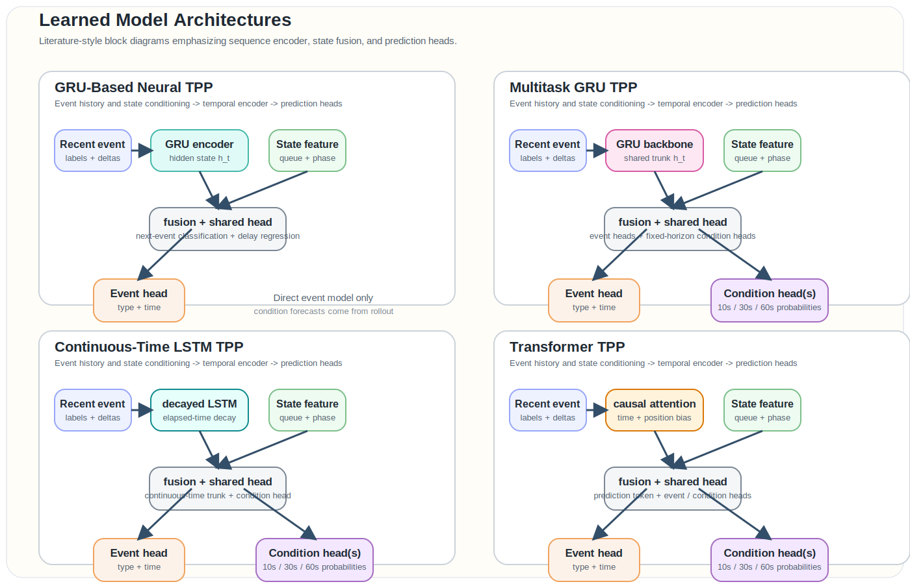
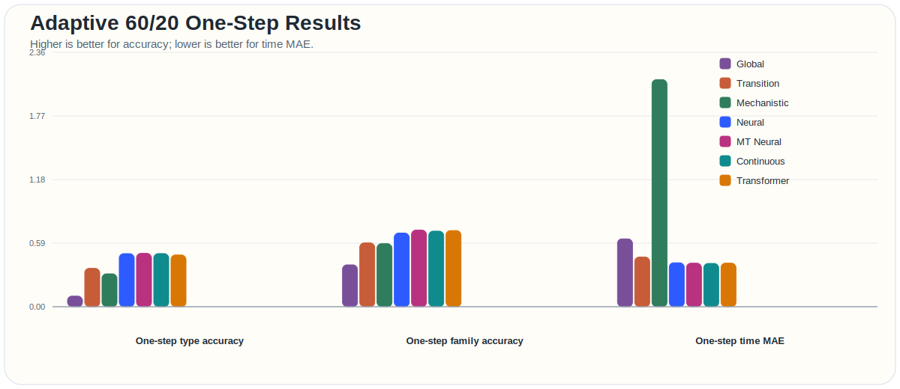
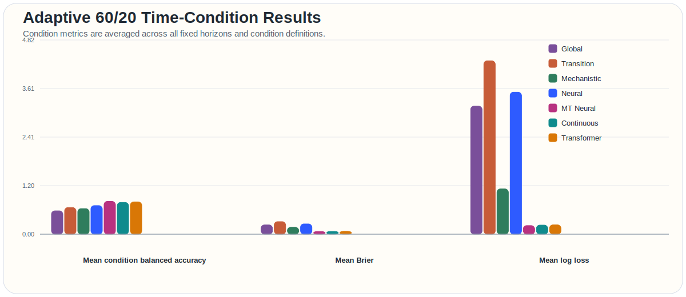
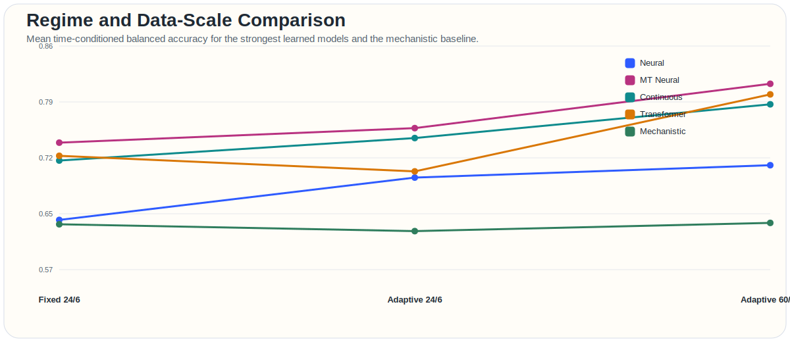

# Technical Report: Event Prediction in a Controlled Traffic Simulation

## 1. Scope

This report documents the current event-prediction benchmark in this repository and is structured so it can expand as we add:

- new model families
- new simulation environments
- richer probabilistic evaluation
- more explicit event/state representations

The current application is a four-way traffic intersection simulator with both `adaptive` and `fixed` signal-control modes. The main modeling question is:

\[
p(t_{i+1}, m_{i+1} \mid \mathcal{H}_i, s_i),
\]

where:

- \(t_{i+1}\) is the next event time
- \(m_{i+1}\) is the next event label
- \(\mathcal{H}_i\) is the event history
- \(s_i\) is the explicit system state

In the current traffic environment, the event vocabulary includes marks such as:

- `phase_change:NS_GREEN`
- `vehicle_arrival:north`
- `vehicle_departure:west`

The repository now evaluates both:

- event prediction
- higher-level condition forecasting such as congestion and corridor pressure

## 2. Application Space

### 2.1 General Template

The broader application class is controlled dynamical systems with:

- asynchronous events
- explicit or latent state
- control logic
- stochastic external inputs
- state transitions that matter at multiple time scales

Examples that fit the same template include:

- manufacturing cells
- warehouse operations
- computer-network control loops
- healthcare workflows
- service systems

That is why this repo is useful beyond traffic. It is a prototype for event prediction in systems where state, control, and timing interact tightly.

### 2.2 Current Traffic Application

The current environment is a single signalized intersection with:

- four inbound approaches: `north`, `south`, `east`, `west`
- queueing at each lane
- stochastic arrivals
- service under a saturation headway
- a signal controller cycling through:
  - `NS_GREEN`
  - `ALL_RED`
  - `EW_GREEN`
  - `ALL_RED`

The simulator now supports two controller regimes:

- `adaptive`
  Green durations are a function of queue pressure and arrival-rate pressure.
- `fixed`
  Green durations remain at the base schedule.

That dual-mode setup is useful because it lets us test whether models generalize across controller regimes rather than only memorizing one scheduling policy.

## 3. Current Simulation Design

### 3.1 State

At a high level, the simulation state consists of:

- controller state
  - current phase
  - phase index
  - phase start time
  - phase timing rule
- lane state
  - queue length
  - arrivals
  - departures
  - cumulative wait
  - max queue

Operationally, the controller and lane queues are the primary state variables that drive the event process.

### 3.2 Event Families

The simulator emits three event families:

- `phase_change`
- `vehicle_arrival`
- `vehicle_departure`

These are sufficient to reconstruct the observable control trajectory and the queue trajectory.

### 3.3 Adaptive Control Logic

For adaptive runs, the green duration is computed from queue size and approach demand:

\[
d_{\text{green}} =
\mathrm{clip}\left(
d_{\text{base}} +
w_q (q - q_0) +
w_\lambda (\lambda - \lambda_0),
d_{\min},
d_{\max}
\right),
\]

where:

- \(q\) is corridor queue pressure
- \(\lambda\) is corridor arrival-rate pressure
- \(d_{\text{base}}\) is the nominal green duration
- \(d_{\min}, d_{\max}\) enforce a valid control range

For fixed runs, the green duration is just the base phase duration.

### 3.4 Why This Environment Is Useful

This benchmark is a good first application because it combines:

- interpretable control rules
- nontrivial queue dynamics
- stochastic arrivals
- exact event traces
- meaningful long-horizon forecasting failure modes

It is simple enough to inspect and rich enough to expose differences between empirical, mechanistic, and learned temporal models.

## 4. Model Families

This section is written to stay extensible as new models are added.

### 4.1 Empirical and Mechanistic Baselines

#### Global Rate Baseline

Intuition:
This model predicts events from average recurrence behavior. It does not strongly condition on the current state.

Mathematical sketch:
For each event label \(m\), estimate a typical recurrence gap \(\bar{\Delta}_m\), and predict the earliest label under that recurrence heuristic:

\[
\hat{t}_{m} = t + \max(\epsilon, \bar{\Delta}_m - (t - t_m^{\text{last}})).
\]

This is cheap and often surprisingly competitive on coarse persistent conditions, but it ignores system mechanism.

#### Transition Baseline

Intuition:
This model predicts the next event from empirical transition frequencies and mean transition delay.

Mathematical sketch:

\[
\hat{m}_{i+1} = \arg\max_m \hat{p}(m \mid m_i),
\qquad
\hat{t}_{i+1} = t_i + \mathbb{E}[\Delta t \mid m_i, m_{i+1}].
\]

It is stronger than a pure global-rate model, but it still uses only weak context.

#### Mechanistic Baseline

Intuition:
This model uses explicit queue state, phase timing, and lane-service logic to predict the next plausible event.

Mathematical sketch:
Construct a candidate set \(\mathcal{C}\) containing:

- next phase transition
- next lane arrivals
- next queued departures

Then predict:

\[
(\hat{t}, \hat{m}) = \arg\min_{(t,m)\in\mathcal{C}} t.
\]

This model is highly interpretable and remains a strong reference point, especially when the controller rules are known.

### 4.2 Learned Temporal Models

All learned models predict:

- next-event type
- next-event delay

and some of them also predict fixed-horizon traffic conditions directly.

#### GRU-Based Neural TPP

Intuition:
Encode recent events and state with a recurrent model and predict the next event from the resulting hidden state.

Mathematical sketch:

\[
h_i = \mathrm{GRU}(h_{i-1}, x_i), \qquad
\hat{p}(m_{i+1} \mid h_i, s_i), \qquad
\hat{\Delta t}_{i+1} = f(h_i, s_i).
\]

#### Multitask GRU TPP

Intuition:
Start from the GRU event model, then add direct fixed-horizon heads for condition forecasting.

Mathematical sketch:

\[
h_i = \mathrm{GRU}(h_{i-1}, x_i),
\]

followed by:

\[
\hat{p}(m_{i+1}), \qquad
\hat{\Delta t}_{i+1}, \qquad
\hat{c}_{i,h}
\]

for each condition target \(c\) and horizon \(h \in \{10s, 30s, 60s\}\).

#### Continuous-Time LSTM-Style TPP

Intuition:
Use a recurrent model whose hidden state decays as a function of elapsed time, so the representation naturally evolves between events.

Mathematical sketch:

\[
h_i^- = g(\Delta t_i) \odot h_{i-1},
\qquad
h_i = \mathrm{LSTM}(h_i^-, x_i),
\]

then predict both event outputs and fixed-horizon condition outputs.

#### Transformer TPP

Intuition:
Use causal attention over recent event history instead of relying only on recurrence. This helps when the next event depends on broader temporal patterns.

Mathematical sketch:

\[
z_{1:i} = \mathrm{Transformer}(x_{1:i}),
\]

then predict:

\[
\hat{p}(m_{i+1} \mid z_{1:i}, s_i),
\qquad
\hat{\Delta t}_{i+1} = f(z_{1:i}, s_i),
\qquad
\hat{c}_{i,h} = g_h(z_{1:i}, s_i).
\]

The current implementation also includes rollout-aware training to reduce autoregressive drift.

## 5. Architecture Diagrams

The next figure summarizes the learned models using the kind of block-diagram language commonly used in the temporal modeling literature: a sequence encoder, explicit state fusion, and task-specific heads.

Key takeaways from the architecture view:

- all learned models share the same broad input structure:
  - recent event labels
  - recent inter-event times
  - explicit queue/phase state features
- the main architectural difference is the temporal encoder:
  - GRU
  - decayed LSTM
  - causal attention
- the strongest condition forecasters add direct fixed-horizon heads instead of deriving conditions only from event rollout
- post-hoc probability calibration is now part of the condition-prediction path

## 6. Learning Objectives

### 6.1 Event Objective

The learned models optimize a supervised next-event objective:

\[
\mathcal{L}_{\text{event}} =
\mathcal{L}_{\text{type}} +
\lambda \mathcal{L}_{\text{time}},
\]

where:

- \(\mathcal{L}_{\text{type}}\) is cross-entropy on event labels
- \(\mathcal{L}_{\text{time}}\) is a robust loss on log-delay
- \(\lambda\) balances label and timing prediction

### 6.2 Direct Condition Objective

For the direct-condition models, an additional multitask objective is used:

\[
\mathcal{L}_{\text{total}} =
\mathcal{L}_{\text{event}} +
\beta \mathcal{L}_{\text{cond}},
\]

where \(\mathcal{L}_{\text{cond}}\) is a horizon-conditioned binary loss over condition targets such as:

- congestion
- severe queue
- north-south pressure
- east-west pressure
- corridor imbalance

### 6.3 Calibration

The direct-condition learned models now use post-hoc Platt-style calibration per condition dimension, followed by threshold selection. That matters because condition quality is now evaluated both as:

- binary decision quality
- probabilistic forecast quality

## 7. Evaluation Design

### 7.1 Tasks

The repository evaluates:

1. one-step next-event prediction
2. short rollout forecasting
3. fixed-time condition forecasting

The condition forecasts are scored at:

- `10s`
- `30s`
- `60s`

### 7.2 Metrics

The main event metrics are:

- type accuracy
- family accuracy
- time MAE
- time RMSE
- within-2-seconds rate

The main fixed-time condition metrics are:

- balanced accuracy
- Brier score
- log loss

Balanced accuracy is the main thresholded condition metric because it is less distorted by class imbalance than raw accuracy. Brier and log loss evaluate probability quality rather than only binary decisions.

## 8. Results

### 8.1 Primary Benchmark: Adaptive 60/20

The primary benchmark is now the larger adaptive run:

- `train-runs = 60`
- `eval-runs = 20`

This is currently the most trustworthy benchmark in the repo because it substantially reduces variance relative to the earlier `24/6` runs.

The next figure summarizes one-step event results on that benchmark.

The strongest one-step patterns are:

- `multitask_neural_tpp` has the best exact type accuracy: `0.4962`
- `multitask_neural_tpp` also has the best family accuracy: `0.7125`
- `continuous_tpp` has the best one-step timing: time MAE `0.4025`
- the three strongest learned models are now tightly clustered on one-step event prediction:
  - `multitask_neural_tpp`
  - `continuous_tpp`
  - `neural_tpp`

That is a more stable picture than the earlier smaller benchmark, where event leadership moved around more from run to run.

### 8.2 Fixed-Time Condition Forecasting

The next figure summarizes the fixed-horizon condition task on the same adaptive `60/20` benchmark.

Condition-forecast averages on adaptive `60/20` are:

| Model | Mean Balanced Accuracy | Mean Brier | Mean Log Loss |
|---|---:|---:|---:|
| `global_rate` | 0.5790 | 0.2299 | 3.1767 |
| `transition` | 0.6613 | 0.3113 | 4.3002 |
| `mechanistic` | 0.6344 | 0.1724 | 1.1229 |
| `neural_tpp` | 0.7091 | 0.2550 | 3.5223 |
| `multitask_neural_tpp` | 0.8146 | 0.0659 | 0.2136 |
| `continuous_tpp` | 0.7880 | 0.0693 | 0.2250 |
| `transformer_tpp` | 0.8009 | 0.0712 | 0.2311 |

This is the clearest result in the report:

- direct-condition learned models are now decisively better than rollout-derived condition forecasts
- `multitask_neural_tpp` is the strongest overall condition forecaster on the largest adaptive run
- `continuous_tpp` and `transformer_tpp` are close enough that they should still be treated as competitive
- the plain `neural_tpp` still predicts events well, but its condition probabilities remain much weaker than the direct-condition models

### 8.3 Effect of Regime and Data Scale

The next figure compares mean time-conditioned balanced accuracy across:

- fixed `24/6`
- adaptive `24/6`
- adaptive `60/20`

for the strongest models.

The main patterns are:

- larger training and evaluation sets made a real difference
- the biggest gains came from the direct-condition models
- adaptive control tends to help the learned condition models more than it helps the simple empirical baselines

Numerically, relative to adaptive `24/6`:

- `multitask_neural_tpp` improved from `0.7572` to `0.8146`
- `continuous_tpp` improved from `0.7443` to `0.7880`
- `transformer_tpp` improved from `0.7011` to `0.8009`

This suggests that the smaller benchmark was underestimating what the direct-condition models could do, especially for the transformer.

### 8.4 Fixed vs Adaptive Interpretation

At the current benchmark sizes:

- fixed control is somewhat easier for empirical baselines and the mechanistic model
- adaptive control is more favorable to the strongest learned condition models

That split makes sense:

- fixed control is closer to a repeating policy, so hand-built timing assumptions help more
- adaptive control introduces more variable control response, which creates room for models that learn richer input-to-condition mappings

This is especially visible in the condition metrics, where the direct-condition models improve under adaptive forecasting while the simpler empirical baselines typically do not.

## 9. Interpretation

### 9.1 Event prediction and condition prediction are no longer the same problem

One major lesson from the current benchmark is that strong next-event predictors are not automatically strong condition forecasters.

In particular:

- `neural_tpp` remains competitive on one-step event metrics
- but the direct-condition models are much stronger on calibrated condition forecasting

That validates the decision to add explicit fixed-horizon condition heads rather than relying only on autoregressive event rollout.

### 9.2 Calibration matters

The addition of Brier score, log loss, and post-hoc calibration materially changed the picture.

Without probabilistic metrics, the models would look more similar than they really are. With them, the direct-condition models now separate clearly from the rollout-derived condition forecasts.

### 9.3 More runs mattered

The move from `24/6` to `60/20` did not only tighten confidence intervals. It also improved the learned condition models enough to make the ranking more convincing.

That means the earlier benchmarks were not wrong, but they were noisy enough to understate the strongest models.

## 10. Limitations

Important limitations still remain:

- only one application domain is implemented
- the simulator is still intentionally simple
- there is no fixed `60/20` benchmark yet in the report
- the learned models are supervised predictors, not full likelihood-based temporal point processes
- calibration analysis is still aggregate-heavy rather than fully per-condition and per-horizon

So the current report is strong enough for internal technical comparison, but it is not yet a finished publication-style benchmark paper.

## 11. What This Suggests Next

The benchmark now supports a cleaner next-step decision.

The strongest immediate path is:

1. run the matching fixed `60/20` benchmark
2. fold that comparison into the report
3. continue improving the direct-condition models before adding a brand-new model family

At the moment, the models worth prioritizing are:

- `multitask_neural_tpp`
- `continuous_tpp`
- `transformer_tpp`

If another architectural iteration is needed after that, the strongest justification would be:

- better temporal point-process structure
- not more baseline proliferation

## 12. Conclusion

This repository now supports a more mature benchmark than it did at the start of the project.

The main conclusions are:

- the traffic simulator is now a useful controlled testbed for both event and condition forecasting
- direct-condition heads are a major improvement over deriving conditions only from event rollout
- larger train/eval sets materially improved result quality
- `multitask_neural_tpp` is currently the strongest overall condition forecaster on the largest adaptive benchmark
- `continuous_tpp` remains strongest on timing
- `transformer_tpp` has improved enough to remain a serious contender

More broadly, the current system now looks like a credible precursor to richer event/state modeling work rather than only a toy simulator with a few baselines.
